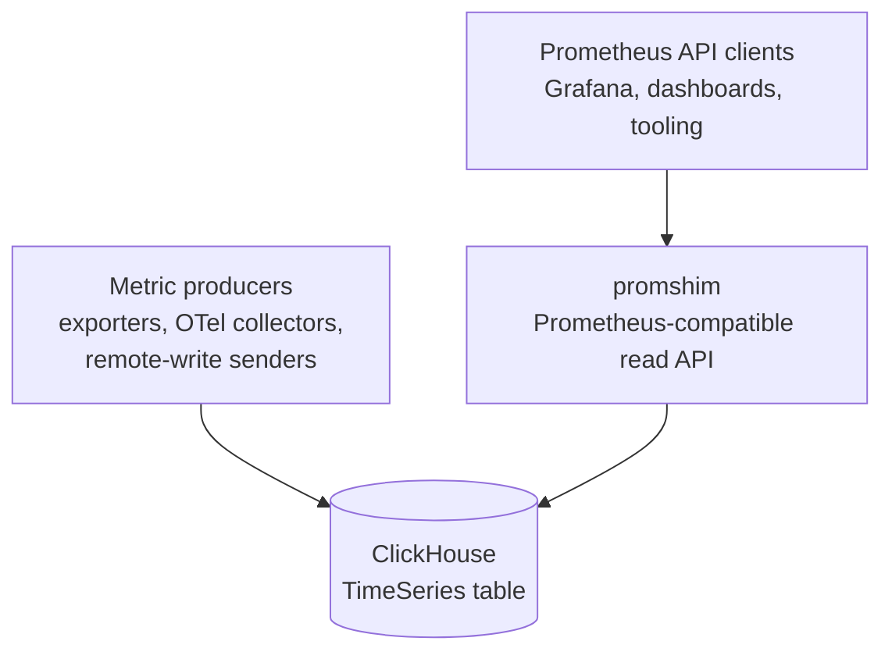

# promshim-clickhouse

`promshim` is a PromQL compatibility layer for metrics stored in ClickHouse's
experimental `TimeSeries` table engine. It exposes the Prometheus HTTP query API
and routes each query through tiered execution: whole-query ClickHouse PromQL
delegation, native ClickHouse SQL lowering, and compatibility-preserving local
fallback.

> **Status:** experimental / preview. `promshim` targets ClickHouse's
> experimental `TimeSeries` table engine. It is heavily compatibility-tested,
> but production use should be validated against your own workloads and
> ClickHouse version.

It lets existing Prometheus clients — most importantly Grafana dashboards and
PromQL-based tooling — continue to ask Prometheus-shaped questions while the
samples live in ClickHouse.

Promshim is **not** a Prometheus server, a scraper, a remote-write receiver, an
Alertmanager, or a replacement for every TSDB responsibility. It is a read-side
bridge: parse PromQL, choose the best safe execution strategy, query
ClickHouse, and return Prometheus-compatible JSON.

## Compatibility at a glance

Promshim aims to be **100% Prometheus-compatible for the query API surface it
serves, as far as exact compatibility is possible outside Prometheus's own TSDB
implementation details**.

The current correctness gate is not a hand-written smoke test. Promshim passes,
within the narrow accepted-deviation policy below:

- the full upstream `prometheus/compliance` PromQL suite, run against reference
  Prometheus and promshim on the same deterministic remote-write fixture with
  varied gauges, resets, sparse series, histogram buckets, and exact ties;
- promshim's own deterministic differential harness and dashboard-focused
  corpora; and
- native-only coverage runs that keep tier-2 gaps visible instead of silently
  hiding them behind fallback execution.

Accepted deviations are limited to narrow, documented cases where exact
Prometheus behavior depends on storage-engine internals or tiny primitive-level
floating-point differences. The current deterministic fixture accepts only a
bounded `demo_memory_usage_bytes % 1.2345` modulo drift; everything else is
treated as a bug or visible coverage gap.

## Where it fits



Read the arrows as:

| Flow | Meaning |
|---|---|
| Producers → ClickHouse | Metric samples are written into ClickHouse, usually through Prometheus remote write or OTel-driven collection. |
| Clients → promshim | Grafana and other Prometheus API clients call `/api/v1/query`, `/api/v1/query_range`, and metadata endpoints. |
| promshim → ClickHouse | Promshim reads `timeSeriesTags(...)` / `timeSeriesData(...)`, or delegates whole queries to `prometheusQuery(...)` / `prometheusQueryRange(...)` when safe. |

In the broader observability ecosystem, promshim sits between these pieces:

- **Prometheus clients:** promshim speaks the query-side subset of the
  Prometheus HTTP API so dashboards and diagnostic tools can keep using PromQL.
- **ClickHouse:** ClickHouse owns storage and most heavy execution. Promshim
  reads `timeSeriesTags(...)`, `timeSeriesData(...)`, and, when safe,
  ClickHouse's `prometheusQuery(...)` / `prometheusQueryRange(...)` table
  functions.
- **OpenTelemetry:** in the intended migration path, OTel handles collection and
  normalization while ClickHouse becomes the long-term telemetry store. Promshim
  preserves Prometheus read compatibility during that migration.
- **Grafana:** existing Prometheus datasource panels can point at promshim, while
  newer panels may use the ClickHouse datasource directly.
- **Thanos/Mimir/Cortex/VictoriaMetrics:** promshim is much narrower. It does
  not provide distributed Prometheus storage, replication, compaction, rule
  evaluation, or alerting. Its job is to make ClickHouse-hosted metrics usable
  from PromQL consumers.

## What it does

Promshim serves the Prometheus query and metadata API surface used by Grafana and similar clients:

- instant and range queries: `/api/v1/query`, `/api/v1/query_range`;
- metadata: `/api/v1/labels`, `/api/v1/label/{name}/values`, `/api/v1/series`;
- explain endpoints: `/api/v1/query_explain`, `/api/v1/query_range_explain`, and `explain=1`;
- operations endpoints: `/metrics`, `/health`, `/-/healthy`, `/-/ready`.

Details: [`docs/http-api.md`](docs/http-api.md).

## How it works

Every request is parsed with the upstream Prometheus parser, planned, routed to the safest available execution tier, executed against ClickHouse, and rendered in the Prometheus response shape.

Execution priority is deliberate:

1. whole-query delegation to ClickHouse PromQL,
2. repository-owned native SQL lowering,
3. local execution with subtree pushdown,
4. full local execution as the correctness fallback.

As ClickHouse's native PromQL support matures, more queries should move upward in that list and less compatibility code should remain in the shim.

## Execution modes

The default mode is controlled by `PROM_SHIM_NATIVE_LOWERING_MODE` and can be
overridden per request with `native_lowering_mode=...`.

| Mode | Served result | Native/delegated behavior | Use case |
|---|---|---|---|
| `prefer` | First successful tier in priority order | Enabled | Normal mode; this is the default. |
| `off` | Local executor | Disabled except ordinary ClickHouse reads needed by local plans | Baseline/debug mode. |
| `explain` | Same planning freedom as `prefer` | Enabled | Always include explain output in normal query responses. |
| `shadow` | Local executor | Runs a native/delegated candidate in the background and records comparison metrics | Safe rollout and divergence detection. |
| `force_supported` | Native SQL root only | Fails unless the final root plan is `native_sql` | Native-only compliance and gap discovery. |

Shadow mode exposes process-local counters/histograms under `/metrics`. It is
intended for rollout confidence, not durable audit storage.

## Cost routing policies

Cost routing is opt-in. The default `strict` policy keeps the tier-priority order: whole-query delegation, native SQL, local with pushdown, then full local. `cost_shadow` computes decisions while serving strict/reference results; `cost_prefer` may serve a cheaper safe candidate only when estimates, confidence checks, hard caps, and explicit family gates pass.

Rollback is configuration-only: set `PROM_SHIM_ROUTING_POLICY=strict` or remove the family gate. Details: [`docs/cost-routing.md`](docs/cost-routing.md).

## PromQL coverage

Promshim gates compatibility against upstream Prometheus compliance, repo-owned differential corpora, dashboard-focused corpora, and native-only gap reports. The tier-2/native SQL path covers selectors, common aggregations, binary operators, supported range functions, histogram helpers, label mutation, absence functions, subqueries, offset/`@`, and selected vector matching shapes; unsupported or uncertain native shapes must remain visible through fallback or native-only gap reporting rather than hidden in the compliance allowlist.

Details: [`docs/promql-coverage.md`](docs/promql-coverage.md).

## Data model assumptions

Promshim expects metrics in a ClickHouse `TimeSeries` table, usually `observability.prometheus`. It reads tags through `timeSeriesTags(...)`, samples through `timeSeriesData(...)`, and delegates whole PromQL queries through `prometheusQuery(...)` / `prometheusQueryRange(...)` only when safe.

ClickHouse `TimeSeries` is still experimental. Schema assumptions live in `internal/promshim/storage/schema/`; deployment tuning lives in [`docs/clickhouse-timeseries-deployment-tuning.md`](docs/clickhouse-timeseries-deployment-tuning.md).

## Configuration

Most local runs use the defaults from the harness. For direct runs, the minimum settings are the ClickHouse address, database, table, and credentials:

```bash
PROM_SHIM_CLICKHOUSE_NATIVE_ADDR=127.0.0.1:9000 \
PROM_SHIM_CLICKHOUSE_DATABASE=observability \
PROM_SHIM_CLICKHOUSE_TABLE=prometheus \
go run ./cmd/promshim
```

The default execution mode is `PROM_SHIM_NATIVE_LOWERING_MODE=prefer`; the default routing policy is `PROM_SHIM_ROUTING_POLICY=strict`. Details: [`docs/configuration.md`](docs/configuration.md).

## Quick start for local development

### Run fast local checks

The fast local gate mirrors the lightweight checks expected before committing:

```bash
make pre-commit
```

It runs gofmt verification, `go mod tidy` verification, `golangci-lint`, and
Go tests. Install the repository Git hook once per clone to run the same checks
before commits that touch Go or tooling files:

```bash
make hooks-install
```

The hook always runs `git diff --cached --check` and skips the Go checks for
documentation-only commits. Use `make hooks-uninstall` to remove the local
`core.hooksPath` setting.

### Run the main validation workflow

From the repository root:

```bash
./scripts/run-harness.sh
```

That runs:

1. the deterministic differential corpus,
2. the stable dashboard subset,
3. the upstream PromQL compliance harness, and
4. the native-SQL benchmark tripwire.

Warm runs are expected to be fast; the scripts intentionally run in the
foreground and should not be wrapped in long external timeouts.

### Run only compliance

```bash
./scripts/run-compliance.sh
```

This performs two passes:

1. `prefer` mode, allowlist-gated; this is the correctness gate.
2. `force_supported` native-only mode, used to keep native gaps visible.

Useful variants:

```bash
./scripts/run-compliance.sh --skip-native
./scripts/run-compliance.sh --skip-prefer
./scripts/run-compliance.sh --keep-up
```

### Start a stack and query promshim manually

The compliance stack exposes Prometheus on `:29090`, promshim on `:29091`, and
ClickHouse HTTP on `:28123` plus native TCP on `:29000`. Promshim uses the
native driver transport by default:

```bash
./scripts/run-compliance.sh --keep-up --skip-native

curl 'http://localhost:29091/api/v1/query?query=up'

curl 'http://localhost:29091/api/v1/query_explain?query=sum%20by%20(job)%20(up)'

curl 'http://localhost:29091/api/v1/query?query=sum%20by%20(job)%20(up)&explain=1'
```

To run the same stack with the legacy HTTP/JSON transport for rollback testing:

```bash
PROM_SHIM_CLICKHOUSE_TRANSPORT=http ./scripts/run-compliance.sh --keep-up --skip-native

curl -i 'http://localhost:29091/api/v1/query?query=up'
```

Native mode serves repository-owned native SQL, metadata, and whole-query
ClickHouse PromQL delegation through the driver. HTTP remains an explicit
rollback transport and ClickHouse remote-write ingestion remains HTTP.

Release note for the transport change: deployments upgrading from an earlier
HTTP-default build should ensure ClickHouse native TCP is reachable at
`PROM_SHIM_CLICKHOUSE_NATIVE_ADDR`, or set `PROM_SHIM_CLICKHOUSE_TRANSPORT=http`
to keep the previous transport while investigating driver rollout issues.

When finished:

```bash
cd harness/compliance && docker compose down
```

### Run promshim directly

If you already have a ClickHouse `TimeSeries` table:

```bash
go run ./cmd/promshim
```

Then point a Prometheus-compatible client at `http://localhost:9090`.

## Benchmarks and profiling

Use `run-sweep.sh` for benchmark/compliance sweeps. It keeps long-range benchmark data in an isolated benchmark stack instead of the frozen compliance volumes.

```bash
# Preview selected work and rough data size; no side effects.
./scripts/run-sweep.sh --dry-run --estimate

# Seed missing benchmark-only data once, then reuse it.
./scripts/run-sweep.sh --setup --profile all --density sparse --target both

# Run a named sweep under harness/artifacts/bench/sweeps/<name>/.
./scripts/run-sweep.sh --name pr-42-default
```

Recent benchmark snapshots and CBE/native-grid interpretation live in [`docs/benchmark-results.md`](docs/benchmark-results.md). Harness architecture and artifact contracts live in [`docs/harness-architecture.md`](docs/harness-architecture.md).

## Why this exists

Promshim explores ClickHouse as the metrics system of record while preserving Prometheus-shaped reads for Grafana and PromQL tooling. It is useful when the target workload is bursty historical querying over long-retention metrics and the team wants to avoid operating a parallel Prometheus-compatible long-term store.

The trade-off is that promshim must preserve Prometheus query semantics over ClickHouse's experimental `TimeSeries` engine, so compatibility gates and fallback behavior matter as much as native SQL performance. Details: [`docs/design-rationale.md`](docs/design-rationale.md).

## Repository map

| Path | Role |
|---|---|
| `cmd/promshim/` | Promshim binary entrypoint. |
| `internal/promshim/httpapi/` | Prometheus-compatible HTTP routing and response rendering. |
| `internal/promshim/logical/` | PromQL logical plan representation and logical optimization. |
| `internal/promshim/native/` | Native-lowering analysis, capability metadata, and optimizer. |
| `internal/promshim/native/renderer/` | ClickHouse SQL renderer for native lowering. |
| `internal/promshim/storage/` | ClickHouse HTTP client and SQL builders over `TimeSeries`. |
| `internal/promshim/local/` | Local executor and fallback/subtree-pushdown planner. |
| `internal/promshim/shadow/` | Shadow-mode comparison and metrics. |
| `harness/` | Deterministic differential harness and query corpora. |
| `harness/compliance/` | Upstream PromQL compliance harness integration. |
| `scripts/` | Local validation, benchmark, profile, and stack helpers. |
| `docs/promql-coverage.md` | Detailed supported/unsupported PromQL coverage and validation gates. |
| `docs/cost-routing.md` | CBE policy, gates, headers, and served-family validation requirements. |
| `docs/benchmark-results.md` | Current benchmark snapshot and CBE/native-grid interpretation. |
| `docs/harness-architecture.md` | Harness command boundaries, stack isolation, and public artifact contracts. |
| `docs/optimizer-contracts.md` | Optimizer evidence, IR invariant, query-family, explain, and rejection-reason contract. |
| `docs/optimization-rollout.md` | Rollout, calibration, regression, and rollback guidance for optimization work. |
| `docs/clickhouse-tuning-inventory.md` | Inventory of ClickHouse tuning surfaces and shim-owned settings profile rules. |
| `docs/clickhouse-reference-profile.md` | Operator-facing reference ClickHouse profile and benchmark-context guidance for promshim workloads. |
| `docs/clickhouse-timeseries-deployment-tuning.md` | TimeSeries schema and data-layout recommendations for promshim workloads. |

## Development rules of thumb

- Treat the execution priority as a hard invariant: whole-query delegation,
  then native SQL, then subtree pushdown, then local fallback.
- Put unrelated new semantic coverage in tier 1 or tier 2. CBE work may improve
  tiers 3 and 4 as known-correct routing candidates when the change is tied to
  routing quality, safety caps, observability, or measured performance.
- Do not add compliance allowlist entries for shim gaps. Fix the gap or leave it
  visible.
- Use the harness before claiming support. For native work, run the native-only
  pass as well as the normal prefer-mode gate.
- For performance changes, keep the SQL shape, profile counters, and before/after
  benchmark artifacts with the change so the trade-off is reviewable.

## Current status

Promshim is a working compatibility bridge for the repository's ClickHouse
`TimeSeries` metrics experiments. Its Prometheus query compatibility is gated by
the full upstream compliance suite plus repo-owned differential/dashboard
harnesses, with only narrow documented deviations for behavior that cannot be
reproduced exactly outside Prometheus internals. The main native SQL path has
broad PromQL family coverage, but the project should still be read as an active
migration/compatibility layer rather than a general-purpose Prometheus
replacement. The benchmark snapshot in [`docs/benchmark-results.md`](docs/benchmark-results.md) is used as both a regression tripwire and a CBE calibration source. Cost-based routing is implemented but narrowly served; strict
tier-priority routing remains the default today.
