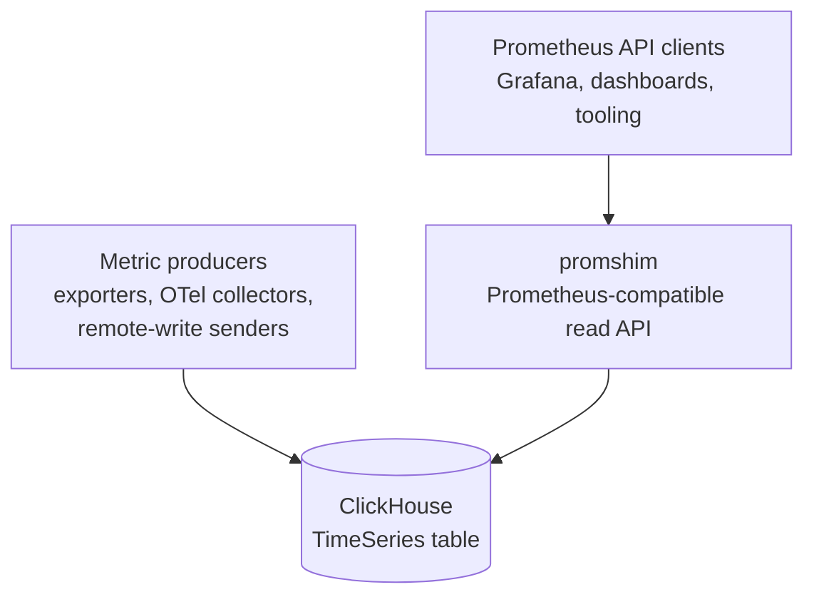

# promshim-clickhouse

`promshim` is a PromQL compatibility layer for metrics stored in ClickHouse's
experimental `TimeSeries` table engine. It exposes the Prometheus HTTP query API
and routes each query through tiered execution: whole-query ClickHouse PromQL
delegation, native ClickHouse SQL lowering, and compatibility-preserving local
fallback.

> **Status:** experimental / preview. `promshim` targets ClickHouse's
> experimental `TimeSeries` table engine. It is heavily compatibility-tested,
> but production use should be validated against your own workloads and
> ClickHouse version.

It lets existing Prometheus clients — most importantly Grafana dashboards and
PromQL-based tooling — continue to ask Prometheus-shaped questions while the
samples live in ClickHouse.

Promshim is **not** a Prometheus server, a scraper, a remote-write receiver, an
Alertmanager, or a replacement for every TSDB responsibility. It is a read-side
bridge: parse PromQL, choose the best safe execution strategy, query
ClickHouse, and return Prometheus-compatible JSON.

## Compatibility at a glance

Promshim aims to be **100% Prometheus-compatible for the query API surface it
serves, as far as exact compatibility is possible outside Prometheus's own TSDB
implementation details**.

The current correctness gate is not a hand-written smoke test. Promshim passes,
within the narrow accepted-deviation policy below:

- the full upstream `prometheus/compliance` PromQL suite, run against reference
  Prometheus and promshim on the same frozen fixture;
- promshim's own deterministic differential harness and dashboard-focused
  corpora; and
- native-only coverage runs that keep tier-2 gaps visible instead of silently
  hiding them behind fallback execution.

The only accepted deviations are narrow, documented cases where exact
Prometheus behavior depends on storage-engine internals or tiny primitive-level
floating-point differences. Everything else is treated as a bug or visible
coverage gap.

## Where it fits



Read the arrows as:

| Flow | Meaning |
|---|---|
| Producers → ClickHouse | Metric samples are written into ClickHouse, usually through Prometheus remote write or OTel-driven collection. |
| Clients → promshim | Grafana and other Prometheus API clients call `/api/v1/query`, `/api/v1/query_range`, and metadata endpoints. |
| promshim → ClickHouse | Promshim reads `timeSeriesTags(...)` / `timeSeriesData(...)`, or delegates whole queries to `prometheusQuery(...)` / `prometheusQueryRange(...)` when safe. |

In the broader observability ecosystem, promshim sits between these pieces:

- **Prometheus clients:** promshim speaks the query-side subset of the
  Prometheus HTTP API so dashboards and diagnostic tools can keep using PromQL.
- **ClickHouse:** ClickHouse owns storage and most heavy execution. Promshim
  reads `timeSeriesTags(...)`, `timeSeriesData(...)`, and, when safe,
  ClickHouse's `prometheusQuery(...)` / `prometheusQueryRange(...)` table
  functions.
- **OpenTelemetry:** in the intended migration path, OTel handles collection and
  normalization while ClickHouse becomes the long-term telemetry store. Promshim
  preserves Prometheus read compatibility during that migration.
- **Grafana:** existing Prometheus datasource panels can point at promshim, while
  newer panels may use the ClickHouse datasource directly.
- **Thanos/Mimir/Cortex/VictoriaMetrics:** promshim is much narrower. It does
  not provide distributed Prometheus storage, replication, compaction, rule
  evaluation, or alerting. Its job is to make ClickHouse-hosted metrics usable
  from PromQL consumers.

## What it does

Promshim currently implements these HTTP surfaces:

| Endpoint | Purpose |
|---|---|
| `GET /api/v1/query` | Prometheus instant query API |
| `GET /api/v1/query_range` | Prometheus range query API |
| `GET /api/v1/labels` | Label-name metadata over the ClickHouse `TimeSeries` table |
| `GET /api/v1/label/{name}/values` | Label-value metadata |
| `GET /api/v1/series` | Series metadata |
| `GET /api/v1/query_explain` | Plan-only instant-query explain output |
| `GET /api/v1/query_range_explain` | Plan-only range-query explain output |
| `GET /metrics` | Prometheus-format promshim process/shadow-mode metrics |
| `GET /health`, `GET /-/healthy`, `GET /-/ready` | Health/readiness probes |

Normal query responses use the Prometheus response envelope:

```json
{
  "status": "success",
  "data": {
    "resultType": "vector",
    "result": []
  }
}
```

Successful query responses also include advisory headers:

- `X-Promshim-Strategy` — root execution strategy, such as `delegated_promql`,
  `native_sql`, `local`, or `chunked_local`.
- `X-Promshim-Fallback-Reason` — why a lower-priority strategy was used, when
  available.
- `X-Promshim-CH-Roundtrips` — ClickHouse request count observed while serving
  the HTTP request.
- `X-Promshim-CH-Millis` — cumulative ClickHouse request time observed by
  promshim.

`explain=1` or `explain=true` on the normal query endpoints keeps the regular
Prometheus `data` payload and adds a top-level `plan` object. The dedicated
`*_explain` endpoints return the plan without executing the query.

## How it works

Every PromQL request goes through the same pipeline:

1. **Parse with the upstream Prometheus parser.**
   The Go module currently vendors `github.com/prometheus/prometheus` and uses
   its PromQL parser/types so syntax and type checking stay close to upstream.
2. **Build and analyze a logical plan.**
   Promshim records expression kind, output type, label lineage, time
   requirements, selector shape, and native-lowering eligibility.
3. **Route by strict execution priority.**
   Higher tiers always beat lower tiers:

   1. **Whole-query delegation to ClickHouse PromQL** — send the complete query
      to ClickHouse's `prometheusQuery(...)` or `prometheusQueryRange(...)` when
      the conservative capability map says ClickHouse can safely own the entire
      expression.
   2. **Repository-owned native SQL lowering** — render ClickHouse SQL directly
      over the `TimeSeries` table functions. This is the main development path.
   3. **Local Go executor with subtree pushdown** — evaluate the expression in
      promshim, but push eligible subtrees down to native SQL or ClickHouse
      PromQL delegation.
   4. **Full local execution** — correctness fallback when no higher tier can
      serve the request.

4. **Execute against ClickHouse.**
   ClickHouse is queried over HTTP with parameterized multipart requests,
   `allow_experimental_time_series_table=1`, and `FORMAT JSONEachRow`.
5. **Decode and render Prometheus JSON.**
   Native ClickHouse rows are decoded into promshim's runtime vector/matrix
   model, response limits are enforced, and the result is streamed back in the
   Prometheus API shape.

The priority order is deliberate. Promshim is a bridge, not the desired final
query engine. As ClickHouse's native PromQL support matures, more queries should
move into whole-query delegation and less code should remain in the shim.

## Execution modes

The default mode is controlled by `PROM_SHIM_NATIVE_LOWERING_MODE` and can be
overridden per request with `native_lowering_mode=...`.

| Mode | Served result | Native/delegated behavior | Use case |
|---|---|---|---|
| `prefer` | First successful tier in priority order | Enabled | Normal mode; this is the default. |
| `off` | Local executor | Disabled except ordinary ClickHouse reads needed by local plans | Baseline/debug mode. |
| `explain` | Same planning freedom as `prefer` | Enabled | Always include explain output in normal query responses. |
| `shadow` | Local executor | Runs a native/delegated candidate in the background and records comparison metrics | Safe rollout and divergence detection. |
| `force_supported` | Native SQL root only | Fails unless the final root plan is `native_sql` | Native-only compliance and gap discovery. |

Shadow mode exposes process-local counters/histograms under `/metrics`. It is
intended for rollout confidence, not durable audit storage.

## PromQL coverage

### Supported in tier 2 native SQL

Tier 2 native SQL is a complete PromQL execution path for the float-sample and
classic-histogram surface this repo targets. In `force_supported` mode, the full
upstream compliance suite and repo-owned harness suites run with **no unsupported
native roots**.

Within that scalar/classic-histogram scope, this means the full PromQL
expression surface: selectors, matchers, `offset`, `@`, subqueries,
aggregations, selection aggregations, scalar and vector arithmetic, comparisons,
vector matching, set operators, range functions, counter functions, classic
histogram bucket queries and histogram helper functions, label mutation, sort
functions, scalar roots, `absent`, `absent_over_time`, `info`, and the rest of
the PromQL feature set exercised by the upstream parser/compliance suite and our
repo-owned harnesses.

### Not supported

- **Prometheus native histogram samples.** Promshim supports classic Prometheus
  histograms represented as `_bucket`, `_sum`, and `_count` time series. Native
  histogram sample payloads are outside the current scope because the ClickHouse
  `TimeSeries` remote-write/read path used by this repo does not currently store
  or round-trip those native histogram payloads.

### Accepted deviations

Known accepted deviations are intentionally narrow and live in
`harness/compliance/expected-failures.json`:

- **`topk` exact-tie ordering:** Prometheus's tie-break depends on TSDB series
  iteration order, which is a storage-engine implementation detail and is not
  derivable from labels alone.
- **ClickHouse-vs-Go modulo float drift:** absolute error must stay within
  `1e-6`, with labels and timestamps still matching exactly. This accounts for
  two different floating-point remainder algorithms. ClickHouse computes modulo
  as `x - trunc(x / y) * y`, which performs a division, truncation,
  multiplication, and subtraction. Go/Prometheus uses Go's `math.Mod`, whose
  portable implementation repeatedly subtracts scaled powers-of-two multiples of
  `abs(y)` using `Frexp`/`Ldexp`, then reapplies the sign of `x`. Both implement
  the same remainder semantics, but they round at different intermediate steps,
  so very large operands can differ by tiny amounts.

Anything else is treated as a visible bug or coverage gap, not something to
hide in the allowlist.

### Validation

The compatibility claim is checked continuously against Prometheus, not inferred
from a few examples:

- `go run ./cmd/promshim-matrix` generates `path2-compliance-matrix.md` and
  `path2-compliance-matrix.json` from the parser-visible feature surface.
- `./scripts/run-compliance.sh` runs the full upstream
  `prometheus/compliance` PromQL suite against reference Prometheus and promshim
  on the same frozen fixture.
- `./scripts/run-harness.sh` runs repo-owned differential corpora,
  dashboard-focused corpora, compliance, and the benchmark tripwire.

Current compatibility matrix, refreshed after the native-lowering IR migration:

| Surface | Matrix rows | Tier-2 native SQL status | Notes |
|---|---:|---|---|
| Selectors and matchers | 5 | 5/5 supported | Instant selectors plus equality, inequality, regex, and negative-regex matchers. |
| Time modifiers | 5 | 5/5 supported | `offset`, literal `@`, `@ start()`, `@ end()`, and selector subqueries. |
| Aggregations | 14 | 14/14 supported | Includes ordinary aggregations plus `topk`, `bottomk`, `count_values`, `limitk`, and `limit_ratio`. |
| Binary and set operators | 16 | 16/16 supported | Arithmetic, comparison, bool comparison, `and`, `or`, and `unless`. |
| Vector matching | 5 | 5/5 supported | `on`, `ignoring`, `group_left`, `group_right`, and `fill`. |
| Functions | 83 | 83/83 supported | Range functions, counter functions, scalar/math functions, label mutation, sort family, `absent*`, `info`, and classic-histogram helpers. |
| **Total parser-visible matrix** | **128** | **128/128 supported** | Generated from Prometheus parser version `v0.311.2`. |

Latest upstream compliance gate run:

| Mode | Total queries | Passed exactly or within tolerance | Expected diff | Unsupported roots | Unexpected failures |
|---|---:|---:|---:|---:|---:|
| `prefer` | 539 | 538 | 1 `topk` exact-tie ordering case | 0 | 0 |
| `force_supported` | 539 | 538 | 1 `topk` exact-tie ordering case | 0 | 0 |

The single diff is the documented `topk` TSDB-order tie-break. The modulo drift
case is handled by the explicit `1e-6` tolerance and matched during the run.

## Data model assumptions

Promshim expects metrics in a ClickHouse `TimeSeries` table, normally:

```sql
CREATE DATABASE IF NOT EXISTS observability;
CREATE TABLE IF NOT EXISTS observability.prometheus ENGINE = TimeSeries;
```

The harness configures ClickHouse's Prometheus remote-write endpoint at
`/write`, backed by that table. Promshim reads the same table through:

- `timeSeriesTags(database.table)` for series metadata, label matchers, and
  min/max time bounds.
- `timeSeriesData(database.table)` for sample rows.
- `prometheusQuery(...)` and `prometheusQueryRange(...)` only when whole-query
  or subtree PromQL delegation is selected.

The `TimeSeries` engine is still experimental in ClickHouse, so the schema
contract is centralized under `internal/promshim/storage/schema/` to make
upstream ClickHouse changes easier to audit.

## Configuration

`cmd/promshim` reads configuration from environment variables:

| Variable | Default | Meaning |
|---|---:|---|
| `PROM_SHIM_LISTEN_ADDR` | `:9090` | HTTP listen address. |
| `PROM_SHIM_CLICKHOUSE_TRANSPORT` | `http` | ClickHouse transport: `http` for the legacy JSONEachRow path or `native` for the ClickHouse Go driver. HTTP remains the rollback/default mode. |
| `PROM_SHIM_CLICKHOUSE_ENDPOINT` | `http://127.0.0.1:8123/` | ClickHouse HTTP endpoint, still required for HTTP mode and delegated-PromQL compatibility fallback while native delegation decoding is incomplete. |
| `PROM_SHIM_CLICKHOUSE_NATIVE_ADDR` | `127.0.0.1:9000` | ClickHouse native TCP address used when `PROM_SHIM_CLICKHOUSE_TRANSPORT=native`. |
| `PROM_SHIM_CLICKHOUSE_DATABASE` | `observability` | ClickHouse database containing the `TimeSeries` table. |
| `PROM_SHIM_CLICKHOUSE_TABLE` | `prometheus` | ClickHouse `TimeSeries` table name. |
| `PROM_SHIM_CLICKHOUSE_USERNAME` | `default` | ClickHouse user. |
| `PROM_SHIM_CLICKHOUSE_PASSWORD` | `otel` | ClickHouse password. |
| `PROM_SHIM_CLICKHOUSE_COMPRESSION` | `off` | Native driver compression: `off`, `lz4`, or `zstd`. |
| `PROM_SHIM_CLICKHOUSE_MAX_OPEN_CONNS` | `10` | Native driver maximum open connections. |
| `PROM_SHIM_CLICKHOUSE_MAX_IDLE_CONNS` | `10` | Native driver maximum idle connections. |
| `PROM_SHIM_CLICKHOUSE_CONN_MAX_LIFETIME_SECONDS` | `3600` | Native driver connection maximum lifetime. |
| `PROM_SHIM_REQUEST_TIMEOUT_SECONDS` | `30` | ClickHouse request timeout. |
| `PROM_SHIM_CLICKHOUSE_VERSION` | `26.3` | Version used by the delegation capability classifier. |
| `PROM_SHIM_NATIVE_LOWERING_MODE` | `prefer` | Global lowering mode; see execution modes above. |
| `PROM_SHIM_MAX_RANGE_POINTS_PER_SERIES` | `50000` | Reject range queries above this point count per series. |
| `PROM_SHIM_RANGE_CHUNK_POINTS_PER_SERIES` | `5000` | Chunk eligible local range plans above this point count per series. |
| `PROM_SHIM_MAX_RESPONSE_SERIES` | `5000` | Reject responses with more series than this limit. |
| `PROM_SHIM_MAX_RESPONSE_POINTS` | `500000` | Reject responses with more total points than this limit. |

Per-request knobs:

- `native_lowering_mode=off|prefer|explain|shadow|force_supported`
- `explain=1` or `explain=true`
- `X-Promshim-Log-Comment: ...` to forward a ClickHouse `log_comment` for query
  log/profile correlation.

Successful query responses include `X-Promshim-CH-Transport: http|native` so
transport rollout can be correlated with strategy, round-trip, and duration
headers. Explain responses include the same value as `clickHouseTransport`.

## Quick start for local development

### Run the main validation workflow

From the repository root:

```bash
./scripts/run-harness.sh
```

That runs:

1. the deterministic differential corpus,
2. the stable dashboard subset,
3. the upstream PromQL compliance harness, and
4. the native-SQL benchmark tripwire.

Warm runs are expected to be fast; the scripts intentionally run in the
foreground and should not be wrapped in long external timeouts.

### Run only compliance

```bash
./scripts/run-compliance.sh
```

This performs two passes:

1. `prefer` mode, allowlist-gated; this is the correctness gate.
2. `force_supported` native-only mode, used to keep native gaps visible.

Useful variants:

```bash
./scripts/run-compliance.sh --skip-native
./scripts/run-compliance.sh --skip-prefer
./scripts/run-compliance.sh --keep-up
```

### Start a stack and query promshim manually

The compliance stack exposes Prometheus on `:29090`, promshim on `:29091`, and
ClickHouse HTTP on `:28123` and native TCP on `:29000`:

```bash
./scripts/run-compliance.sh --keep-up --skip-native

curl 'http://localhost:29091/api/v1/query?query=up'

curl 'http://localhost:29091/api/v1/query_explain?query=sum%20by%20(job)%20(up)'

curl 'http://localhost:29091/api/v1/query?query=sum%20by%20(job)%20(up)&explain=1'
```

To run the same stack with the native driver transport enabled for promshim:

```bash
PROM_SHIM_CLICKHOUSE_TRANSPORT=native ./scripts/run-compliance.sh --keep-up --skip-native

curl -i 'http://localhost:29091/api/v1/query?query=up'
```

During the migration, native mode serves repository-owned native SQL and
metadata queries through the driver. Whole-query ClickHouse PromQL delegation is
kept on an HTTP/JSON compatibility path until the delegated result schema is
fully typed; this is a transport fallback only, not an execution-strategy
fallback.

When finished:

```bash
cd harness/compliance && docker compose down
```

### Run promshim directly

If you already have a ClickHouse `TimeSeries` table:

```bash
go run ./cmd/promshim
```

Then point a Prometheus-compatible client at `http://localhost:9090`.

## Benchmarks and profiling

The benchmark tripwire compares reference Prometheus, promshim native SQL, and
local fallback behavior on pinned corpora:

```bash
./scripts/run-bench.sh --bring-up --matrix
```

Long-range profiles require the compliance stack to be running and the matching
long-range data to be seeded first:

```bash
./scripts/run-compliance.sh --keep-up --skip-classify
./scripts/seed-long-range.sh --profile 30d --target ch
./scripts/run-bench.sh --long-range 30d --matrix
```

Benchmark matrices below were refreshed after the native-lowering IR migration.
They are not a claim that native SQL is always faster than Prometheus; they are a
tripwire and CBE calibration source. `N/P` is `native_p50 / prom_p50`, so values
below `1×` mean native SQL beat Prometheus. `F/N` is
`fallback_p50 / native_p50`, so values below `1×` are a signal that the current
native SQL shape is not worth choosing for that small query class if CBE is
allowed to override strict tier priority.

### Short fixture benchmark matrix

Frozen 1h30m fixture, 10 timed repeats, 2 warmups, all rows routed to
`native_sql`:

| Query | Endpoint | CH rts | CH ms | Prom p50 (ms) | Native p50 (ms) | N/P | Fallback p50 (ms) | F/N |
|---|---|---:|---:|---:|---:|---:|---:|---:|
| vector_match_range | query_range | 1 | 77 | 0.41 | 79.05 | 194.7× | 17.20 | 0.2× |
| topk_range | query_range | 1 | 38 | 0.25 | 39.10 | 155.8× | 10.07 | 0.3× |
| subquery_rate_instant | query | 1 | 31 | 0.21 | 32.07 | 151.3× | 77.78 | 2.4× |
| subquery_rate_range | query_range | 1 | 36 | 0.25 | 37.32 | 150.5× | 1748.70 | 46.9× |
| vector_match_group_left_instant | query | 1 | 27 | 0.19 | 28.43 | 148.9× | 14.54 | 0.5× |
| vector_match_instant | query | 1 | 30 | 0.23 | 31.94 | 135.9× | 16.02 | 0.5× |
| sum_rate_by_job_instant | query | 1 | 23 | 0.20 | 22.99 | 114.9× | 8.46 | 0.4× |
| sum_rate_by_job_range | query_range | 1 | 30 | 0.28 | 31.18 | 110.2× | 181.20 | 5.8× |
| increase_instant | query | 1 | 34 | 0.34 | 34.68 | 103.2× | 14.29 | 0.4× |
| sum_by_job_instant | query | 1 | 13 | 0.14 | 13.72 | 96.0× | 8.90 | 0.6× |
| absent_instant | query | 1 | 11 | 0.12 | 10.85 | 94.3× | 4.78 | 0.4× |
| rate_instant | query | 1 | 19 | 0.22 | 19.67 | 89.4× | 8.99 | 0.5× |
| selector_matcher_instant | query | 1 | 13 | 0.14 | 11.13 | 81.3× | 6.73 | 0.6× |
| topk_instant | query | 1 | 17 | 0.22 | 16.88 | 75.7× | 8.26 | 0.5× |
| plain_selector_instant | query | 1 | 11 | 0.16 | 12.04 | 73.4× | 7.83 | 0.7× |
| selector_regex_instant | query | 1 | 10 | 0.19 | 12.03 | 64.7× | 8.65 | 0.7× |
| avg_by_instance_instant | query | 1 | 13 | 0.22 | 14.08 | 63.4× | 8.23 | 0.6× |
| count_values_instant | query | 1 | 15 | 0.27 | 16.11 | 60.8× | 8.18 | 0.5× |
| plain_selector_range | query_range | 1 | 27 | 0.45 | 27.34 | 60.8× | 7.68 | 0.3× |
| negated_unary_instant | query | 1 | 12 | 0.21 | 12.32 | 59.0× | 8.86 | 0.7× |
| histogram_quantile_instant | query | 1 | 154 | 2.71 | 154.34 | 56.9× | 63.52 | 0.4× |
| offset_instant | query | 1 | 11 | 0.22 | 11.82 | 53.3× | 8.51 | 0.7× |
| binop_scalar_instant | query | 1 | 11 | 0.27 | 12.02 | 45.0× | 8.41 | 0.7× |
| histogram_quantile_range | query_range | 1 | 260 | 6.15 | 259.92 | 42.2× | 1318.98 | 5.1× |

The short fixture is intentionally tiny. Prometheus often answers it from an
in-process TSDB in sub-millisecond time, while native SQL pays at least one
ClickHouse HTTP round trip. The useful signal here is not "native is faster";
it is which query shapes are too small for SQL lowering to be a latency win.

### Long-range benchmark matrix

Category medians across the pinned 7d, 30d, and 1y profiles:

| Category | Prom p50 (7d) | Native p50 (7d) | N/P (7d) | F/N (7d) | Prom p50 (30d) | Native p50 (30d) | N/P (30d) | F/N (30d) | Prom p50 (1y) | Native p50 (1y) | N/P (1y) | F/N (1y) |
|---|---:|---:|---:|---:|---:|---:|---:|---:|---:|---:|---:|---:|
| range_rate | 21.87 | 556.82 | 25.5× | 5.7× | 141.66 | 5045.54 | 35.6× | 1.8× | 487.31 | 6239.82 | 12.8× | 1.2× |
| range_avg_over_time | — | — | — | — | 143.42 | 4881.23 | 34.0× | 1.8× | 510.79 | 6260.77 | 12.3× | 1.1× |
| instant_histogram_quantile | 8.54 | 146.13 | 17.1× | 0.2× | 7.68 | 149.92 | 19.5× | 0.2× | 9.12 | 151.53 | 16.6× | 0.2× |
| range_sum_rate | 127.58 | 1137.10 | 8.9× | 2.7× | 89.40 | 1300.86 | 14.6× | 1.7× | 355.39 | 3139.30 | 8.8× | 1.2× |
| instant_rate_short | 5.88 | 24.91 | 4.7× | 1.5× | 6.09 | 27.31 | 4.5× | 0.9× | — | — | — | — |
| instant_rate_long | 21.18 | 42.28 | 2.0× | 4.5× | 22.23 | 43.63 | 2.4× | 3.5× | 13.34 | 31.96 | 2.4× | 2.4× |
| selector_plain | 3.50 | 14.47 | 4.1× | 0.7× | 2.93 | 15.22 | 5.2× | 0.7× | 2.79 | 15.32 | 5.5× | 0.7× |
| instant_sum_rate | 8.00 | 30.37 | 3.8× | 1.8× | 7.37 | 32.93 | 4.5× | 1.7× | 13.57 | 34.08 | 2.5× | 2.3× |
| selector_regex | 3.80 | 14.60 | 3.8× | 0.7× | — | — | — | — | — | — | — | — |
| instant_avg_over_time | 21.18 | 23.96 | 1.1× | 8.3× | 35.83 | 34.34 | 1.0× | 8.4× | 45.29 | 36.98 | 0.8× | 7.5× |

The long-range matrix shows the current split: native SQL is especially useful
for some long-window instant range functions where local fallback would scan far
more data in Go, but several range-query SQL shapes still need optimization
before they are competitive with reference Prometheus on this fixture.

Cost-based execution (CBE) routing is also planned. The intended first version is
not a dynamic black-box optimizer; it should use static, pre-known heuristics
calibrated from this bench suite to decide when a lower tier is predictably
faster for a bounded small-query class, while keeping strict tier priority as the
default and preserving native-only compliance visibility.

For native SQL optimization work, preserve before/after artifacts and inspect
ClickHouse profile counters rather than relying on wall-clock noise alone. The
repo includes helper scripts such as:

- `scripts/ch-profile-capture.sh`
- `scripts/ch-profile-diff.sh`
- `scripts/ch-explain.sh`
- `scripts/bench-matrix.sh`

## Why this exists, and the trade-offs

Prometheus is excellent at scraping, PromQL, alerting, and the day-to-day
operator workflow around metrics. The hard parts are HA and long-term storage.
For this use case, the awkward workload is **infrequent, large queries**: a
Thanos-style deployment can either keep enough query/store resources running to
answer those queries quickly, which wastes resources while idle, or scale down
aggressively and then have too little query capacity when a large historical
query finally arrives. Other Prometheus-compatible long-term stores solve parts
of this problem, but they still add another metrics storage/query system to run.

This repo explores a different shape: **ClickHouse as the only metrics store**.
The hope is that ClickHouse can own both hot analytical queries and long-term
retention, including native TTLs and object-storage offload, without keeping a
parallel Prometheus+Thanos or Prometheus+ClickHouse storage stack alive.

ClickHouse's `TimeSeries` and PromQL support are still limited compared with
Prometheus itself. Promshim exists to close that read-side compatibility gap: it
lets normal Prometheus dashboards, alert queries, and tools talk to a
Prometheus-compatible API while the underlying samples live only in ClickHouse.
That design chooses an explicit set of trade-offs:

### Benefits

- **Keeps one metrics store.** ClickHouse is the target system of record instead
  of a sidecar analytics copy beside Prometheus or Thanos.
- **Preserves existing PromQL/Grafana workflows** while moving storage and
  long-term retention toward ClickHouse.
- **Keeps correctness measurable** with differential and upstream compliance
  harnesses.
- **Allows gradual rollout** through `prefer`, `shadow`, and `force_supported`
  modes.
- **Can retire shim code incrementally** as ClickHouse whole-query PromQL support
  grows.
- **Fits bursty historical querying better.** The target workload is long idle
  periods punctuated by large queries, where ClickHouse can use OLAP execution
  and storage-tiering features instead of keeping a distributed TSDB query mesh
  hot at all times.
- **Uses ClickHouse where it is strong**: large scans, aggregations, label
  filtering, retention, and object-storage-backed long-range data.

### Costs and limitations

- **It emulates Prometheus semantics over a different storage engine.** Some
  Prometheus behavior depends on TSDB implementation details rather than pure
  PromQL semantics.
- **ClickHouse `TimeSeries` is experimental.** Upstream schema/function changes
  can affect promshim.
- **Not every Prometheus API is implemented.** Promshim serves query and
  metadata endpoints, not scraping, recording rules, alerting, federation,
  admin APIs, or remote write.
- **Performance varies by query shape.** Native SQL is often the goal, but some
  shapes are still slower than Prometheus or require careful SQL-shape work.
- **Local fallback is for safety, not product direction.** New feature work
  should expand whole-query delegation or native SQL lowering, not the lower
  fallback tiers.
- **Operational maturity is intentionally PoC-grade.** This repository is a
  migration playground and validation harness, not a packaged production
  distribution.

## Repository map

| Path | Role |
|---|---|
| `cmd/promshim/` | Promshim binary entrypoint. |
| `internal/promshim/httpapi/` | Prometheus-compatible HTTP routing and response rendering. |
| `internal/promshim/logical/` | PromQL logical plan representation and logical optimization. |
| `internal/promshim/native/` | Native-lowering analysis, capability metadata, and optimizer. |
| `internal/promshim/native/renderer/` | ClickHouse SQL renderer for native lowering. |
| `internal/promshim/storage/` | ClickHouse HTTP client and SQL builders over `TimeSeries`. |
| `internal/promshim/local/` | Local executor and fallback/subtree-pushdown planner. |
| `internal/promshim/shadow/` | Shadow-mode comparison and metrics. |
| `harness/` | Deterministic differential harness and query corpora. |
| `harness/compliance/` | Upstream PromQL compliance harness integration. |
| `scripts/` | Local validation, benchmark, profile, and stack helpers. |

## Development rules of thumb

- Treat the execution priority as a hard invariant: whole-query delegation,
  then native SQL, then subtree pushdown, then local fallback.
- Put new feature coverage in tier 1 or tier 2. Tiers 3 and 4 are fallbacks and
  should only change for correctness fixes unless explicitly requested.
- Do not add compliance allowlist entries for shim gaps. Fix the gap or leave it
  visible.
- Use the harness before claiming support. For native work, run the native-only
  pass as well as the normal prefer-mode gate.
- For performance changes, keep the SQL shape, profile counters, and before/after
  benchmark artifacts with the change so the trade-off is reviewable.

## Current status

Promshim is a working compatibility bridge for the repository's ClickHouse
`TimeSeries` metrics experiments. Its Prometheus query compatibility is gated by
the full upstream compliance suite plus repo-owned differential/dashboard
harnesses, with only narrow documented deviations for behavior that cannot be
reproduced exactly outside Prometheus internals. The main native SQL path has
broad PromQL family coverage, but the project should still be read as an active
migration/compatibility layer rather than a general-purpose Prometheus
replacement. The benchmark matrix above is the current post-IR-migration
snapshot and is intentionally used as both a regression tripwire and a source of
static heuristics for planned CBE routing. Strict tier-priority routing remains
the default today.
