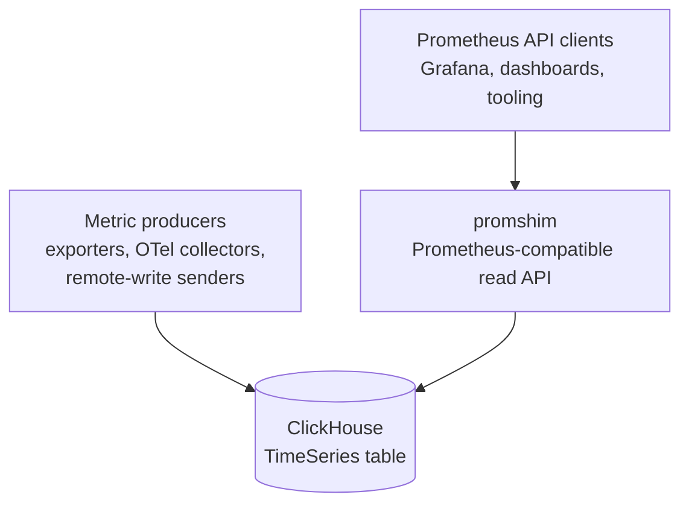

# promshim-clickhouse

`promshim` is a PromQL compatibility layer for metrics stored in ClickHouse's
experimental `TimeSeries` table engine. It exposes the Prometheus HTTP query API
and routes each query through tiered execution: whole-query ClickHouse PromQL
delegation, native ClickHouse SQL lowering, and compatibility-preserving local
fallback.

> **Status:** experimental / preview. `promshim` targets ClickHouse's
> experimental `TimeSeries` table engine. It is heavily compatibility-tested,
> but production use should be validated against your own workloads and
> ClickHouse version.

It lets existing Prometheus clients — most importantly Grafana dashboards and
PromQL-based tooling — continue to ask Prometheus-shaped questions while the
samples live in ClickHouse.

Promshim is **not** a Prometheus server, a scraper, a remote-write receiver, an
Alertmanager, or a replacement for every TSDB responsibility. It is a read-side
bridge: parse PromQL, choose the best safe execution strategy, query
ClickHouse, and return Prometheus-compatible JSON.

## Compatibility at a glance

Promshim aims to be **100% Prometheus-compatible for the query API surface it
serves, as far as exact compatibility is possible outside Prometheus's own TSDB
implementation details**.

The current correctness gate is not a hand-written smoke test. Promshim passes,
within the narrow accepted-deviation policy below:

- the full upstream `prometheus/compliance` PromQL suite, run against reference
  Prometheus and promshim on the same frozen fixture;
- promshim's own deterministic differential harness and dashboard-focused
  corpora; and
- native-only coverage runs that keep tier-2 gaps visible instead of silently
  hiding them behind fallback execution.

The only accepted deviations are narrow, documented cases where exact
Prometheus behavior depends on storage-engine internals or tiny primitive-level
floating-point differences. Everything else is treated as a bug or visible
coverage gap.

## Where it fits



Read the arrows as:

| Flow | Meaning |
|---|---|
| Producers → ClickHouse | Metric samples are written into ClickHouse, usually through Prometheus remote write or OTel-driven collection. |
| Clients → promshim | Grafana and other Prometheus API clients call `/api/v1/query`, `/api/v1/query_range`, and metadata endpoints. |
| promshim → ClickHouse | Promshim reads `timeSeriesTags(...)` / `timeSeriesData(...)`, or delegates whole queries to `prometheusQuery(...)` / `prometheusQueryRange(...)` when safe. |

In the broader observability ecosystem, promshim sits between these pieces:

- **Prometheus clients:** promshim speaks the query-side subset of the
  Prometheus HTTP API so dashboards and diagnostic tools can keep using PromQL.
- **ClickHouse:** ClickHouse owns storage and most heavy execution. Promshim
  reads `timeSeriesTags(...)`, `timeSeriesData(...)`, and, when safe,
  ClickHouse's `prometheusQuery(...)` / `prometheusQueryRange(...)` table
  functions.
- **OpenTelemetry:** in the intended migration path, OTel handles collection and
  normalization while ClickHouse becomes the long-term telemetry store. Promshim
  preserves Prometheus read compatibility during that migration.
- **Grafana:** existing Prometheus datasource panels can point at promshim, while
  newer panels may use the ClickHouse datasource directly.
- **Thanos/Mimir/Cortex/VictoriaMetrics:** promshim is much narrower. It does
  not provide distributed Prometheus storage, replication, compaction, rule
  evaluation, or alerting. Its job is to make ClickHouse-hosted metrics usable
  from PromQL consumers.

## What it does

Promshim currently implements these HTTP surfaces:

| Endpoint | Purpose |
|---|---|
| `GET /api/v1/query` | Prometheus instant query API |
| `GET /api/v1/query_range` | Prometheus range query API |
| `GET /api/v1/labels` | Label-name metadata over the ClickHouse `TimeSeries` table |
| `GET /api/v1/label/{name}/values` | Label-value metadata |
| `GET /api/v1/series` | Series metadata |
| `GET /api/v1/query_explain` | Plan-only instant-query explain output |
| `GET /api/v1/query_range_explain` | Plan-only range-query explain output |
| `GET /metrics` | Prometheus-format promshim process/shadow-mode metrics |
| `GET /health`, `GET /-/healthy`, `GET /-/ready` | Health/readiness probes |

Normal query responses use the Prometheus response envelope:

```json
{
  "status": "success",
  "data": {
    "resultType": "vector",
    "result": []
  }
}
```

Successful query responses also include advisory headers:

- `X-Promshim-Strategy` — root execution strategy, such as `delegated_promql`,
  `native_sql`, `local`, or `chunked_local`.
- `X-Promshim-Fallback-Reason` — why a lower-priority strategy was used, when
  available.
- `X-Promshim-CH-Roundtrips` — ClickHouse request count observed while serving
  the HTTP request.
- `X-Promshim-CH-Millis` — cumulative ClickHouse request time observed by
  promshim.

`explain=1` or `explain=true` on the normal query endpoints keeps the regular
Prometheus `data` payload and adds a top-level `plan` object. The dedicated
`*_explain` endpoints return the plan without executing the query.

## How it works

Every PromQL request goes through the same pipeline:

1. **Parse with the upstream Prometheus parser.**
   The Go module currently vendors `github.com/prometheus/prometheus` and uses
   its PromQL parser/types so syntax and type checking stay close to upstream.
2. **Build and analyze a logical plan.**
   Promshim records expression kind, output type, label lineage, time
   requirements, selector shape, and native-lowering eligibility.
3. **Route by strict execution priority.**
   Higher tiers always beat lower tiers:

   1. **Whole-query delegation to ClickHouse PromQL** — send the complete query
      to ClickHouse's `prometheusQuery(...)` or `prometheusQueryRange(...)` when
      the conservative capability map says ClickHouse can safely own the entire
      expression.
   2. **Repository-owned native SQL lowering** — render ClickHouse SQL directly
      over the `TimeSeries` table functions. This is the main development path.
   3. **Local Go executor with subtree pushdown** — evaluate the expression in
      promshim, but push eligible subtrees down to native SQL or ClickHouse
      PromQL delegation.
   4. **Full local execution** — correctness fallback when no higher tier can
      serve the request.

4. **Execute against ClickHouse.**
   ClickHouse is queried over HTTP with parameterized multipart requests,
   `allow_experimental_time_series_table=1`, and `FORMAT JSONEachRow`.
5. **Decode and render Prometheus JSON.**
   Native ClickHouse rows are decoded into promshim's runtime vector/matrix
   model, response limits are enforced, and the result is streamed back in the
   Prometheus API shape.

The priority order is deliberate. Promshim is a bridge, not the desired final
query engine. As ClickHouse's native PromQL support matures, more queries should
move into whole-query delegation and less code should remain in the shim.

## Execution modes

The default mode is controlled by `PROM_SHIM_NATIVE_LOWERING_MODE` and can be
overridden per request with `native_lowering_mode=...`.

| Mode | Served result | Native/delegated behavior | Use case |
|---|---|---|---|
| `prefer` | First successful tier in priority order | Enabled | Normal mode; this is the default. |
| `off` | Local executor | Disabled except ordinary ClickHouse reads needed by local plans | Baseline/debug mode. |
| `explain` | Same planning freedom as `prefer` | Enabled | Always include explain output in normal query responses. |
| `shadow` | Local executor | Runs a native/delegated candidate in the background and records comparison metrics | Safe rollout and divergence detection. |
| `force_supported` | Native SQL root only | Fails unless the final root plan is `native_sql` | Native-only compliance and gap discovery. |

Shadow mode exposes process-local counters/histograms under `/metrics`. It is
intended for rollout confidence, not durable audit storage.

## Cost routing policies

Cost routing is an opt-in routing policy layered on top of the native lowering
mode. Strict routing remains the default and keeps the priority order above:
whole-query delegation, native SQL, local with pushdown, then full local.
`force_supported`, `off`, and the existing native-lowering `shadow` mode ignore
cost routing so they continue to serve as native-only, local-baseline, and
native-shadow visibility modes.

The global policy is controlled by `PROM_SHIM_ROUTING_POLICY` and can be
overridden per request with `routing_policy=...`.

| Policy | Served result | Use case |
|---|---|---|
| `strict` | First successful tier in priority order | Default and rollback behavior. |
| `cost_shadow` | Strict result | Computes the cost decision and may run bounded alternate candidates in the background for evidence. |
| `cost_prefer` | Strict unless all cost gates pass | Opt-in local/dev rollout for bounded families with estimates, hard caps, and a predicted win. |

Local overrides under `cost_prefer` require explicit family gates through
`PROM_SHIM_COST_ROUTING_LOCAL_FAMILIES`, for example
`selector_instant,rate_instant`. Served requests use cache-only estimates:
cold, missing, or stale selector statistics choose strict/reference behavior
until `cost_shadow` or another bounded warmup path refreshes the estimate cache.
Disabled families, hard-cap violations, low-confidence predictions, histogram
helpers without their own evidence, and broad range-query candidates also fall
back to strict routing. Removing the family gate or setting
`PROM_SHIM_ROUTING_POLICY=strict` is the configuration-only rollback path.

Successful query responses include stable routing headers such as
`X-Promshim-Routing-Policy`, `X-Promshim-Routing-Decision`,
`X-Promshim-Strict-Strategy`, `X-Promshim-Selected-Strategy`,
`X-Promshim-Strict-Candidate`, `X-Promshim-Selected-Candidate`,
`X-Promshim-Served-Candidate`, `X-Promshim-Routing-Reason`, and
`X-Promshim-Cost-Family`. Explain responses include the same routing metadata,
enabled cost-routing local families, and CBE candidate metadata showing the
strict/reference candidate, selected candidate, served candidate, candidate
eligibility, and bounded rejection reasons.

In `cost_shadow`, promshim continues to serve strict/reference results while it
ranks eligible candidates, chooses at most one bounded alternate candidate
(`native_sql`, `local_pushdown`, or `full_local`), and records candidate-level
outcomes. Alternate execution is skipped when the selected candidate is already
served or when there is no executable eligible candidate.

### Current served CBE family gates

Current `cost_prefer` served-candidate enablement is intentionally narrow:

- `rate_instant` (short-window, single-selector instant `rate`/`increase`) may
  serve local when estimates/caps/margins/family-gate checks pass.
- selector/histogram/range families remain strict unless later bounded evidence
  explicitly enables them.
- strict-local fallback paths are not treated as CBE wins (`strict_reference_already_local`).

### Validation bundle required before enabling a new family/candidate

Before enabling any additional served CBE family/candidate, preserve a named
artifact bundle with all of:

1. shadow sparse sweep for the candidate family,
2. warmed cost-prefer differential sweep for the candidate family,
3. long-range sparse negative control,
4. dense/cardinality negative control,
5. strict rollback verification,
6. strict compliance sweep.

Use `go run ./cmd/promshim-routing-calibrate --sweep ...` over that bundle to
refresh `.pi/cost-routing-calibration.json` and `.pi/cost-routing-calibration.md`.
Do not expand served families without this evidence bundle.

## PromQL coverage

### Supported in tier 2 native SQL

Tier 2 native SQL is a complete PromQL execution path for the float-sample and
classic-histogram surface this repo targets. In `force_supported` mode, the full
upstream compliance suite and repo-owned harness suites run with **no unsupported
native roots**.

Within that scalar/classic-histogram scope, this means the full PromQL
expression surface: selectors, matchers, `offset`, `@`, subqueries,
aggregations, selection aggregations, scalar and vector arithmetic, comparisons,
vector matching, set operators, range functions, counter functions, classic
histogram bucket queries and histogram helper functions, label mutation, sort
functions, scalar roots, `absent`, `absent_over_time`, `info`, and the rest of
the PromQL feature set exercised by the upstream parser/compliance suite and our
repo-owned harnesses.

### Not supported

- **Prometheus native histogram samples.** Promshim supports classic Prometheus
  histograms represented as `_bucket`, `_sum`, and `_count` time series. Native
  histogram sample payloads are outside the current scope because the ClickHouse
  `TimeSeries` remote-write/read path used by this repo does not currently store
  or round-trip those native histogram payloads.

### Accepted deviations

Known accepted deviations are intentionally narrow and live in
`harness/compliance/expected-failures.json`:

- **`topk` exact-tie ordering:** Prometheus's tie-break depends on TSDB series
  iteration order, which is a storage-engine implementation detail and is not
  derivable from labels alone.
- **ClickHouse-vs-Go modulo float drift:** absolute error must stay within
  `1e-6`, with labels and timestamps still matching exactly. This accounts for
  two different floating-point remainder algorithms. ClickHouse computes modulo
  as `x - trunc(x / y) * y`, which performs a division, truncation,
  multiplication, and subtraction. Go/Prometheus uses Go's `math.Mod`, whose
  portable implementation repeatedly subtracts scaled powers-of-two multiples of
  `abs(y)` using `Frexp`/`Ldexp`, then reapplies the sign of `x`. Both implement
  the same remainder semantics, but they round at different intermediate steps,
  so very large operands can differ by tiny amounts.

Anything else is treated as a visible bug or coverage gap, not something to
hide in the allowlist.

### Validation

The compatibility claim is checked continuously against Prometheus, not inferred
from a few examples:

- `go run ./cmd/promshim-matrix` generates `path2-compliance-matrix.md` and
  `path2-compliance-matrix.json` from the parser-visible feature surface.
- `./scripts/run-compliance.sh` runs the full upstream
  `prometheus/compliance` PromQL suite against reference Prometheus and promshim
  on the same frozen fixture.
- `./scripts/run-harness.sh` runs repo-owned differential corpora,
  dashboard-focused corpora, compliance, and the benchmark tripwire.

Current compatibility matrix, refreshed after the native-lowering IR migration:

| Surface | Matrix rows | Tier-2 native SQL status | Notes |
|---|---:|---|---|
| Selectors and matchers | 5 | 5/5 supported | Instant selectors plus equality, inequality, regex, and negative-regex matchers. |
| Time modifiers | 5 | 5/5 supported | `offset`, literal `@`, `@ start()`, `@ end()`, and selector subqueries. |
| Aggregations | 14 | 14/14 supported | Includes ordinary aggregations plus `topk`, `bottomk`, `count_values`, `limitk`, and `limit_ratio`. |
| Binary and set operators | 16 | 16/16 supported | Arithmetic, comparison, bool comparison, `and`, `or`, and `unless`. |
| Vector matching | 5 | 5/5 supported | `on`, `ignoring`, `group_left`, `group_right`, and `fill`. |
| Functions | 83 | 83/83 supported | Range functions, counter functions, scalar/math functions, label mutation, sort family, `absent*`, `info`, and classic-histogram helpers. |
| **Total parser-visible matrix** | **128** | **128/128 supported** | Generated from Prometheus parser version `v0.311.2`. |

Latest upstream compliance gate run:

| Mode | Total queries | Passed exactly or within tolerance | Expected diff | Unsupported roots | Unexpected failures |
|---|---:|---:|---:|---:|---:|
| `prefer` | 539 | 538 | 1 `topk` exact-tie ordering case | 0 | 0 |
| `force_supported` | 539 | 538 | 1 `topk` exact-tie ordering case | 0 | 0 |

The single diff is the documented `topk` TSDB-order tie-break. The modulo drift
case is handled by the explicit `1e-6` tolerance and matched during the run.

## Data model assumptions

Promshim expects metrics in a ClickHouse `TimeSeries` table, normally:

```sql
CREATE DATABASE IF NOT EXISTS observability;
CREATE TABLE IF NOT EXISTS observability.prometheus ENGINE = TimeSeries;
```

The harness configures ClickHouse's Prometheus remote-write endpoint at
`/write`, backed by that table. Promshim reads the same table through:

- `timeSeriesTags(database.table)` for series metadata, label matchers, and
  min/max time bounds.
- `timeSeriesData(database.table)` for sample rows.
- `prometheusQuery(...)` and `prometheusQueryRange(...)` only when whole-query
  or subtree PromQL delegation is selected.

The `TimeSeries` engine is still experimental in ClickHouse, so the schema
contract is centralized under `internal/promshim/storage/schema/` to make
upstream ClickHouse changes easier to audit. Deployment-level TimeSeries tuning
recommendations live in `docs/clickhouse-timeseries-deployment-tuning.md`; the
native grid-function lowering design lives in
`docs/native-grid-function-lowering.md`; the rejected per-series pruning scout is
recorded in `docs/per-series-time-bound-pruning.md`.

## Configuration

`cmd/promshim` reads configuration from environment variables:

| Variable | Default | Meaning |
|---|---:|---|
| `PROM_SHIM_LISTEN_ADDR` | `:9090` | HTTP listen address. |
| `PROM_SHIM_CLICKHOUSE_TRANSPORT` | `native` | ClickHouse transport: `native` for the ClickHouse Go driver or `http` for the legacy JSONEachRow rollback path. |
| `PROM_SHIM_CLICKHOUSE_ENDPOINT` | `http://127.0.0.1:8123/` | ClickHouse HTTP endpoint used by HTTP transport mode and retained as rollback configuration. |
| `PROM_SHIM_CLICKHOUSE_NATIVE_ADDR` | `127.0.0.1:9000` | ClickHouse native TCP address used when `PROM_SHIM_CLICKHOUSE_TRANSPORT=native`. |
| `PROM_SHIM_CLICKHOUSE_DATABASE` | `observability` | ClickHouse database containing the `TimeSeries` table. |
| `PROM_SHIM_CLICKHOUSE_TABLE` | `prometheus` | ClickHouse `TimeSeries` table name. |
| `PROM_SHIM_CLICKHOUSE_USERNAME` | `default` | ClickHouse user. |
| `PROM_SHIM_CLICKHOUSE_PASSWORD` | `otel` | ClickHouse password. |
| `PROM_SHIM_CLICKHOUSE_COMPRESSION` | `off` | Native driver compression: `off`, `lz4`, or `zstd`. |
| `PROM_SHIM_CLICKHOUSE_MAX_OPEN_CONNS` | `10` | Native driver maximum open connections. |
| `PROM_SHIM_CLICKHOUSE_MAX_IDLE_CONNS` | `10` | Native driver maximum idle connections. |
| `PROM_SHIM_CLICKHOUSE_CONN_MAX_LIFETIME_SECONDS` | `3600` | Native driver connection maximum lifetime. |
| `PROM_SHIM_REQUEST_TIMEOUT_SECONDS` | `30` | ClickHouse request timeout. The `default_safe` ClickHouse settings profile also sends this as `max_execution_time`. |
| `PROM_SHIM_CLICKHOUSE_VERSION` | `26.3` | Version used by delegation and settings-profile capability classifiers. |
| `PROM_SHIM_CLICKHOUSE_SETTINGS_PROFILE` | `default_safe` | Shim-owned per-query ClickHouse settings profile. Supported names: `none`, `default_safe`, `repeated_selective`, `tiny_instant`, `simple_range`, `long_range_scan`, `aggregation_heavy`, `join_heavy`, `subtree_pushdown`, `benchmark_control`. `benchmark_control` is an explicit measurement profile that applies bounded `max_threads=4`; other performance profile names remain gated until measured evidence justifies applied settings. |
| `PROM_SHIM_CLICKHOUSE_MAX_MEMORY_USAGE_BYTES` | `0` | Optional `default_safe` per-query `max_memory_usage` cap; `0` leaves it unset. |
| `PROM_SHIM_CLICKHOUSE_MAX_ROWS_TO_READ` | `0` | Optional `default_safe` per-query `max_rows_to_read` cap; `0` leaves it unset until estimates justify a cap. |
| `PROM_SHIM_CLICKHOUSE_MAX_RESULT_ROWS` | `0` | Optional `default_safe` per-query `max_result_rows` cap; `0` leaves it unset until a result-row contract is explicit. |
| `PROM_SHIM_PROMOTED_TAG_COLUMNS` | empty | Comma-separated Prometheus label names whose ClickHouse `tags_to_columns` column has the same name on the TimeSeries tags table. Native selector SQL uses these columns for label matchers and label projection instead of probing `src.tags[...]`. |
| `PROM_SHIM_DISCOVER_PROMOTED_TAG_COLUMNS` | `false` | When true, promshim queries ClickHouse `system.columns` / `system.tables` at startup and adds identity `tags_to_columns` entries (`'label':'label'`) to the promoted tag column set. Explicit `PROM_SHIM_PROMOTED_TAG_COLUMNS` entries are still honored. Discovery failure is logged and ignored. |
| `PROM_SHIM_NATIVE_GRID_FUNCTIONS` | `prefer` | Native-grid lowering gate. `prefer` lets supported tier-2 range selectors for `rate`, `irate`, `delta`, `idelta`, and `last_over_time` use ClickHouse TimeSeries grid functions; set `off` to roll back to promshim's SQL-level kernels. |
| `PROM_SHIM_CUMULATIVE_AVG_OVER_TIME` | `prefer` | High-overlap `avg_over_time` lowering gate. `prefer` uses cumulative per-series state plus ASOF boundary lookups to avoid dense grid-to-data join fanout; set `off` to roll back to the direct grouped aggregate path. |
| `PROM_SHIM_NATIVE_LOWERING_MODE` | `prefer` | Global lowering mode; see execution modes above. |
| `PROM_SHIM_ROUTING_POLICY` | `strict` | Global cost-routing policy; see cost routing policies above. |
| `PROM_SHIM_COST_ROUTING_LOCAL_FAMILIES` | empty | Comma-separated family gates eligible for `cost_prefer` local overrides, e.g. `selector_instant,rate_instant`. |
| `PROM_SHIM_DISABLE_OPTIMIZED_IR` | unset / false | Rollback/differential-testing gate that disables logical IR rewrite passes while preserving baseline planning. |
| `PROM_SHIM_DISABLE_NATIVE_AGGREGATION_LABEL_PROJECTION` | unset / false | Rollback/differential-testing gate that disables native `by(...)` aggregation child label projection and restores full selector tag materialization. |
| `PROM_SHIM_DISABLE_NATIVE_REPEATED_SUBEXPRESSION_REUSE` | unset / false | Rollback/differential-testing gate that disables native SQL reuse for identical vector subexpressions. |
| `PROM_SHIM_DISABLE_LOCAL_REPEATED_EXPRESSION_CACHE` | unset / false | Rollback/differential-testing gate that disables request-local caching for repeated local range-function subexpressions. |
| `PROM_SHIM_MAX_RANGE_POINTS_PER_SERIES` | `50000` | Reject range queries above this point count per series. |
| `PROM_SHIM_RANGE_CHUNK_POINTS_PER_SERIES` | `5000` | Chunk eligible local range plans above this point count per series. |
| `PROM_SHIM_MAX_RESPONSE_SERIES` | `5000` | Reject query responses and `/series` metadata responses with more series than this limit. |
| `PROM_SHIM_MAX_RESPONSE_POINTS` | `500000` | Reject query responses with more total points than this limit. |
| `PROM_SHIM_MAX_METADATA_ITEMS` | `50000` | Reject `/labels` and label-values metadata responses with more items than this limit. |

Per-request knobs:

- `native_lowering_mode=off|prefer|explain|shadow|force_supported`
- `routing_policy=strict|cost_shadow|cost_prefer`
- `explain=1` or `explain=true`
- `X-Promshim-Log-Comment: ...` to forward a ClickHouse `log_comment` for query
  log/profile correlation. When omitted, promshim generates a bounded comment
  containing endpoint, normalized mode/policy, and a hash of request parameters;
  raw PromQL and label values are not included.

Successful query responses include `X-Promshim-CH-Transport: http|native` so
transport rollout can be correlated with strategy, round-trip, and duration
headers. They also include `X-Promshim-Settings-Profile` when a settings profile
was resolved. Explain responses include the same transport value as
`clickHouseTransport` and settings provenance as `clickHouseSettingsProfile` and
`plan.settingsProfile`.

## Quick start for local development

### Run the main validation workflow

From the repository root:

```bash
./scripts/run-harness.sh
```

That runs:

1. the deterministic differential corpus,
2. the stable dashboard subset,
3. the upstream PromQL compliance harness, and
4. the native-SQL benchmark tripwire.

Warm runs are expected to be fast; the scripts intentionally run in the
foreground and should not be wrapped in long external timeouts.

### Run only compliance

```bash
./scripts/run-compliance.sh
```

This performs two passes:

1. `prefer` mode, allowlist-gated; this is the correctness gate.
2. `force_supported` native-only mode, used to keep native gaps visible.

Useful variants:

```bash
./scripts/run-compliance.sh --skip-native
./scripts/run-compliance.sh --skip-prefer
./scripts/run-compliance.sh --keep-up
```

### Start a stack and query promshim manually

The compliance stack exposes Prometheus on `:29090`, promshim on `:29091`, and
ClickHouse HTTP on `:28123` plus native TCP on `:29000`. Promshim uses the
native driver transport by default:

```bash
./scripts/run-compliance.sh --keep-up --skip-native

curl 'http://localhost:29091/api/v1/query?query=up'

curl 'http://localhost:29091/api/v1/query_explain?query=sum%20by%20(job)%20(up)'

curl 'http://localhost:29091/api/v1/query?query=sum%20by%20(job)%20(up)&explain=1'
```

To run the same stack with the legacy HTTP/JSON transport for rollback testing:

```bash
PROM_SHIM_CLICKHOUSE_TRANSPORT=http ./scripts/run-compliance.sh --keep-up --skip-native

curl -i 'http://localhost:29091/api/v1/query?query=up'
```

Native mode serves repository-owned native SQL, metadata, and whole-query
ClickHouse PromQL delegation through the driver. HTTP remains an explicit
rollback transport and ClickHouse remote-write ingestion remains HTTP.

Release note for the transport change: deployments upgrading from an earlier
HTTP-default build should ensure ClickHouse native TCP is reachable at
`PROM_SHIM_CLICKHOUSE_NATIVE_ADDR`, or set `PROM_SHIM_CLICKHOUSE_TRANSPORT=http`
to keep the previous transport while investigating driver rollout issues.

When finished:

```bash
cd harness/compliance && docker compose down
```

### Run promshim directly

If you already have a ClickHouse `TimeSeries` table:

```bash
go run ./cmd/promshim
```

Then point a Prometheus-compatible client at `http://localhost:9090`.

## Benchmarks and profiling

The preferred entry point for benchmark/compliance sweeps is `run-sweep.sh`.
It keeps long-range benchmark data in an isolated benchmark stack, separate from
the frozen compliance volumes:

```bash
# Preview the default 7d sparse benchmark/compliance plan; no side effects.
./scripts/run-sweep.sh --dry-run --estimate

# One-time setup of benchmark data in benchmark-only volumes.
./scripts/run-sweep.sh --setup --profile all --density sparse --target both

# Named sweep artifacts under harness/artifacts/sweeps/pr-42-default/.
./scripts/run-sweep.sh --name pr-42-default

# Dense processing-corpus preview; --estimate implies dry-run unless --execute is passed.
./scripts/run-sweep.sh --profile 7d --density dense --corpus-set processing --estimate

# Benchmark data reset; deletes benchmark volumes only, never compliance volumes.
./scripts/run-sweep.sh --bench-reset --yes
```

Sweep artifacts include `manifest.json`, `summary.md`, `summary.json`, one or
more v2 benchmark reports, `memory-summary-*.json`, and when `--memory detailed`
is selected, whole-run pprof snapshots under `memory-detail-*/`. Render matrices
from a completed sweep with:

```bash
./scripts/bench-matrix.sh --sweep harness/artifacts/sweeps/pr-42-default/manifest.json
./scripts/bench-matrix.sh --sweep harness/artifacts/sweeps/pr-42-default/manifest.json --per-query
```

Seed policies are explicit: `reuse` requires pre-seeded data, `missing` seeds
only missing profile/density targets, `always` deliberately writes again, and
`never` skips seed checks/writes. Sparse profiles are fast and broad; dense
profiles use higher cardinality and processing corpora with advisory Prometheus
p50 target bands. Disk/runtime estimates are rough and host-dependent. Detailed
memory mode uses `PROM_SHIM_ENABLE_PPROF=1` in local harness stacks; keep that
disabled in production unless the endpoint is otherwise protected.

`run-bench.sh` and `seed-long-range.sh` remain available as lower-level/debug
helpers, but avoid manual long-range command repetition for normal work because
it is easy to accidentally point at the compliance stack. If using those helpers
directly, pass explicit benchmark endpoints from `run-sweep.sh --bench-status`.

The legacy benchmark tripwire compares reference Prometheus, promshim native
SQL, and local fallback behavior on pinned corpora:

```bash
./scripts/run-bench.sh --bring-up --matrix
```

Benchmark matrices below were refreshed from live sweep artifacts on this branch:

- `harness/artifacts/sweeps/readme-refresh-20260426-7d-sparse`
- `harness/artifacts/sweeps/readme-refresh-20260426-long-range-sparse`
- `harness/artifacts/sweeps/readme-refresh-20260426-7d-dense-processing`

These are not a claim that promshim beats Prometheus in this local harness.
They are a routing calibration/tripwire dataset. In addition to p50 latency, the
matrices include CBE decision telemetry (`routingDecision`, `routingReason`,
strict/served candidate IDs) and memory-side signals from
`memory-summary-*.json`.

The matrix artifacts below were captured before native-grid lowering became the
default. They therefore reflect the explicit rollback behavior
`PROM_SHIM_NATIVE_GRID_FUNCTIONS=off`. The native-grid default was measured
separately as a focused before/after check:
`harness/artifacts/sweeps/native-grid-focused-baseline` and
`harness/artifacts/sweeps/native-grid-focused-candidate`.

### 7d sparse CBE category matrix (strict vs cost_prefer)

10 timed repeats, 2 warmups, mode `prefer`, routing policies
`strict,cost_shadow,cost_prefer`, with `cost_shadow` warmup and
`PROM_SHIM_COST_ROUTING_LOCAL_FAMILIES=rate_instant`.

| Category | Count | Strict strategy/p50 | Cost-prefer strategy/p50 | CBE decision | Δ vs strict |
|---|---:|---:|---:|---|---:|
| `aggregation_by_projection` | 1 | native_sql:1/31.95 | native_sql:1/30.69 | `strict_low_confidence:1` | -3.9% |
| `instant_avg_over_time` | 1 | native_sql:1/36.50 | native_sql:1/36.20 | `strict_over_cap:1` | -0.8% |
| `instant_histogram_quantile` | 2 | native_sql:2/133.50 | native_sql:2/133.03 | `strict_low_confidence:2` | -0.4% |
| `instant_rate_long` | 1 | native_sql:1/37.59 | native_sql:1/38.11 | `strict_over_cap:1` | +1.4% |
| `instant_rate_short` | 2 | native_sql:2/33.65 | local:2/21.24 | `local_override:2` | -36.9% |
| `instant_repeated_aggregation_subexpr` | 2 | native_sql:2/36.92 | native_sql:2/37.16 | `strict_over_cap:2` | +0.7% |
| `instant_repeated_subexpr` | 1 | native_sql:1/32.91 | native_sql:1/33.16 | `strict_low_confidence:1` | +0.8% |
| `instant_sum_rate` | 1 | native_sql:1/36.47 | native_sql:1/36.96 | `strict_low_confidence:1` | +1.3% |
| `range_aggregation_by_projection` | 1 | native_sql:1/48.83 | native_sql:1/45.28 | `strict_low_confidence:1` | -7.3% |
| `range_rate` | 1 | native_sql:1/99.54 | native_sql:1/100.20 | `strict_over_cap:1` | +0.7% |
| `range_repeated_aggregation_subexpr` | 1 | native_sql:1/168.08 | native_sql:1/168.71 | `strict_over_cap:1` | +0.4% |
| `range_repeated_subexpr` | 5 | native_sql:5/98.56 | native_sql:5/99.03 | `strict_over_cap:5` | +0.5% |
| `range_sum_rate` | 1 | native_sql:1/164.33 | native_sql:1/163.09 | `strict_over_cap:1` | -0.8% |
| `selector_plain` | 1 | delegated_promql:1/12.69 | delegated_promql:1/11.61 | `strict_low_confidence:1` | -8.6% |
| `selector_regex` | 1 | delegated_promql:1/12.51 | delegated_promql:1/12.55 | `strict_low_confidence:1` | +0.4% |

### Long-range sparse matrix (category medians)

Category medians across `7d`, `30d`, and `1y` corpora, comparing strict
(`prefer` + `strict`) to `cost_prefer`.

| Category | 7d strict | 7d cost_prefer | 7d decision | 30d strict | 30d cost_prefer | 30d decision | 1y strict | 1y cost_prefer | 1y decision |
|---|---:|---:|---|---:|---:|---|---:|---:|---|
| `aggregation_by_projection` | 31.41 | 30.78 | `strict_low_confidence:1` | — | — | — | — | — | — |
| `instant_avg_over_time` | 35.76 | 35.98 | `strict_over_cap:1` | 40.68 | 40.19 | `strict_over_cap:1` | 37.06 | 38.32 | `strict_over_cap:1` |
| `instant_histogram_quantile` | 129.54 | 130.34 | `strict_low_confidence:2` | 119.88 | 119.55 | `strict_over_cap:1` | 122.54 | 120.77 | `strict_over_cap:1` |
| `instant_rate_long` | 38.21 | 36.67 | `strict_over_cap:1` | 38.66 | 38.51 | `strict_over_cap:2` | 34.52 | 34.04 | `strict_over_cap:3` |
| `instant_rate_short` | 33.56 | 20.78 | `local_override:2` | 33.93 | 15.96 | `local_override:1` | — | — | — |
| `instant_repeated_aggregation_subexpr` | 37.00 | 36.96 | `strict_over_cap:2` | — | — | — | — | — | — |
| `instant_repeated_subexpr` | 32.59 | 32.16 | `strict_low_confidence:1` | — | — | — | — | — | — |
| `instant_sum_rate` | 36.59 | 37.20 | `strict_low_confidence:1` | 37.54 | 37.36 | `strict_over_cap:1` | 37.62 | 36.70 | `strict_over_cap:1` |
| `range_aggregation_by_projection` | 46.54 | 45.78 | `strict_low_confidence:1` | — | — | — | — | — | — |
| `range_avg_over_time` | — | — | — | 396.12 | 407.89 | `strict_over_cap:1` | 543.21 | 542.96 | `strict_over_cap:1` |
| `range_rate` | 97.80 | 98.32 | `strict_over_cap:1` | 497.04 | 501.34 | `strict_over_cap:1` | 564.27 | 571.16 | `strict_over_cap:1` |
| `range_repeated_aggregation_subexpr` | 163.14 | 164.90 | `strict_over_cap:1` | — | — | — | — | — | — |
| `range_repeated_subexpr` | 100.21 | 99.39 | `strict_over_cap:5` | — | — | — | — | — | — |
| `range_sum_rate` | 157.37 | 162.78 | `strict_over_cap:1` | 184.54 | 188.81 | `strict_over_cap:1` | 344.72 | 344.60 | `strict_over_cap:1` |
| `selector_plain` | 12.81 | 12.01 | `strict_low_confidence:1` | 12.42 | 11.93 | `strict_low_confidence:1` | 12.27 | 11.91 | `strict_low_confidence:1` |
| `selector_regex` | 12.30 | 13.33 | `strict_low_confidence:1` | — | — | — | — | — | — |

### 7d dense processing matrix

Dense-profile processing corpus (`bench-processing-7d.json`) remains a hard-cap
control where `cost_prefer` should not flip serving.

| Query | Prom band | Strict strategy/p50 | Cost-prefer strategy/p50 | Decision | Reason |
|---|---|---:|---:|---|---|
| `processing_sum_rate_1h_by_job_instant_7d` | too_fast | native_sql/53.52 | native_sql/50.15 | `strict_over_cap` | `hard_cap` |
| `processing_sum_rate_6h_by_job_mode_instant_7d` | too_fast | native_sql/60.51 | native_sql/60.07 | `strict_over_cap` | `hard_cap` |
| `processing_avg_memory_6h_by_job_type_instant_7d` | too_fast | native_sql/57.77 | native_sql/59.79 | `strict_over_cap` | `hard_cap` |
| `processing_histogram_quantile_1h_instant_7d` | too_fast | native_sql/131.61 | native_sql/130.71 | `strict_over_cap` | `hard_cap` |
| `processing_sum_rate_5m_by_job_range_24h_7d` | too_fast | native_sql/11514.28 | native_sql/11625.58 | `strict_over_cap` | `hard_cap` |
| `processing_sum_rate_1h_by_job_range_7d` | too_slow | error/timeout | error/timeout | `n/a` | `n/a` |
| `processing_avg_memory_1h_by_job_type_range_24h_7d` | in_band | native_sql/12122.48 | native_sql/11788.71 | `strict_over_cap` | `hard_cap` |
| `processing_histogram_quantile_1h_range_24h_7d` | in_band | native_sql/5325.95 | native_sql/5290.24 | `strict_over_cap` | `hard_cap` |

### Native-grid default check

With the default `PROM_SHIM_NATIVE_GRID_FUNCTIONS=prefer`, focused 7d sparse
range-rate rows showed large wins while staying on `native_sql` with one
ClickHouse roundtrip:

| Query | Rollback/off p50 | Native-grid p50 | Δ |
|---|---:|---:|---:|
| `sum_rate_by_job_range_7d` prefer | 161.12 | 70.03 | -56.5% |
| `sum_rate_by_job_range_7d` force_supported | 165.28 | 69.09 | -58.2% |
| `rate_5m_range_1d` prefer | 92.75 | 48.31 | -47.9% |
| `rate_5m_range_1d` force_supported | 97.79 | 48.71 | -50.2% |

### What this implies for CBE today

- **Strict remains the reference default and rollback path.** `cost_prefer` is
  still gated by explicit confidence/cap checks and family allowlists.
- **One served flip remains consistently validated:** short-window instant
  `rate` can serve `full_local` (`local_override`) with a large p50 win versus
  strict native SQL on sparse `7d`/`30d` profiles.
- **Most other families stay strict by design:** `strict_over_cap`,
  `strict_low_confidence`, and disabled family gates dominate outside that
  narrow allowlist.
- **Native SQL range-rate work has materially improved strict behavior:** the
  rollback SQL kernel has sparse 7d range-rate category medians around
  `98–100 ms`, and range-sum-rate medians around `157–164 ms`; the native-grid
  default is substantially faster for the focused range-rate rows above.
- **Native-grid is the default range-function kernel where validated, with a
  simple rollback:** set `PROM_SHIM_NATIVE_GRID_FUNCTIONS=off` to return
  supported `rate`, `irate`, `delta`, `idelta`, and `last_over_time` range
  selectors to promshim's SQL-level implementations.
- **Dense range processing is still the main gap:** heavy 24h range processing
  rows remain multi-second and `processing_sum_rate_1h_by_job_range_7d` still
  times out in this harness.
- **Memory telemetry was mostly clean:** the sparse runs had no missing log
  comments; the dense processing run had missing query-log comments only for the
  timed-out `processing_sum_rate_1h_by_job_range_7d` row.

For native SQL optimization work, preserve before/after artifacts and inspect
ClickHouse profile counters rather than relying on wall-clock noise alone. The
repo includes helper scripts such as:

- `scripts/ch-profile-capture.sh`
- `scripts/ch-profile-diff.sh`
- `scripts/ch-explain.sh`
- `scripts/bench-matrix.sh`

## Why this exists, and the trade-offs

Prometheus is excellent at scraping, PromQL, alerting, and the day-to-day
operator workflow around metrics. The hard parts are HA and long-term storage.
For this use case, the awkward workload is **infrequent, large queries**: a
Thanos-style deployment can either keep enough query/store resources running to
answer those queries quickly, which wastes resources while idle, or scale down
aggressively and then have too little query capacity when a large historical
query finally arrives. Other Prometheus-compatible long-term stores solve parts
of this problem, but they still add another metrics storage/query system to run.

This repo explores a different shape: **ClickHouse as the only metrics store**.
The hope is that ClickHouse can own both hot analytical queries and long-term
retention, including native TTLs and object-storage offload, without keeping a
parallel Prometheus+Thanos or Prometheus+ClickHouse storage stack alive.

ClickHouse's `TimeSeries` and PromQL support are still limited compared with
Prometheus itself. Promshim exists to close that read-side compatibility gap: it
lets normal Prometheus dashboards, alert queries, and tools talk to a
Prometheus-compatible API while the underlying samples live only in ClickHouse.
That design chooses an explicit set of trade-offs:

### Benefits

- **Keeps one metrics store.** ClickHouse is the target system of record instead
  of a sidecar analytics copy beside Prometheus or Thanos.
- **Preserves existing PromQL/Grafana workflows** while moving storage and
  long-term retention toward ClickHouse.
- **Keeps correctness measurable** with differential and upstream compliance
  harnesses.
- **Allows gradual rollout** through `prefer`, `shadow`, and `force_supported`
  modes.
- **Can retire shim code incrementally** as ClickHouse whole-query PromQL support
  grows.
- **Fits bursty historical querying better.** The target workload is long idle
  periods punctuated by large queries, where ClickHouse can use OLAP execution
  and storage-tiering features instead of keeping a distributed TSDB query mesh
  hot at all times.
- **Uses ClickHouse where it is strong**: large scans, aggregations, label
  filtering, retention, and object-storage-backed long-range data.

### Costs and limitations

- **It emulates Prometheus semantics over a different storage engine.** Some
  Prometheus behavior depends on TSDB implementation details rather than pure
  PromQL semantics.
- **ClickHouse `TimeSeries` is experimental.** Upstream schema/function changes
  can affect promshim.
- **Not every Prometheus API is implemented.** Promshim serves query and
  metadata endpoints, not scraping, recording rules, alerting, federation,
  admin APIs, or remote write.
- **Performance varies by query shape.** Native SQL is often the goal, but some
  shapes are still slower than Prometheus or require careful SQL-shape work.
- **Local fallback is for safety, not product direction.** New feature work
  should expand whole-query delegation or native SQL lowering, not the lower
  fallback tiers.
- **Operational maturity is intentionally PoC-grade.** This repository is a
  migration playground and validation harness, not a packaged production
  distribution.

## Repository map

| Path | Role |
|---|---|
| `cmd/promshim/` | Promshim binary entrypoint. |
| `internal/promshim/httpapi/` | Prometheus-compatible HTTP routing and response rendering. |
| `internal/promshim/logical/` | PromQL logical plan representation and logical optimization. |
| `internal/promshim/native/` | Native-lowering analysis, capability metadata, and optimizer. |
| `internal/promshim/native/renderer/` | ClickHouse SQL renderer for native lowering. |
| `internal/promshim/storage/` | ClickHouse HTTP client and SQL builders over `TimeSeries`. |
| `internal/promshim/local/` | Local executor and fallback/subtree-pushdown planner. |
| `internal/promshim/shadow/` | Shadow-mode comparison and metrics. |
| `harness/` | Deterministic differential harness and query corpora. |
| `harness/compliance/` | Upstream PromQL compliance harness integration. |
| `scripts/` | Local validation, benchmark, profile, and stack helpers. |
| `docs/optimizer-contracts.md` | Optimizer evidence, IR invariant, query-family, explain, and rejection-reason contract. |
| `docs/clickhouse-tuning-inventory.md` | Inventory of ClickHouse tuning surfaces and shim-owned settings profile rules. |
| `docs/clickhouse-reference-profile.md` | Operator-facing reference ClickHouse profile and benchmark-context guidance for promshim workloads. |
| `docs/optimization-rollout.md` | Rollout, calibration, regression, and rollback guidance for optimization work. |

## Development rules of thumb

- Treat the execution priority as a hard invariant: whole-query delegation,
  then native SQL, then subtree pushdown, then local fallback.
- Put unrelated new semantic coverage in tier 1 or tier 2. CBE work may improve
  tiers 3 and 4 as known-correct routing candidates when the change is tied to
  routing quality, safety caps, observability, or measured performance.
- Do not add compliance allowlist entries for shim gaps. Fix the gap or leave it
  visible.
- Use the harness before claiming support. For native work, run the native-only
  pass as well as the normal prefer-mode gate.
- For performance changes, keep the SQL shape, profile counters, and before/after
  benchmark artifacts with the change so the trade-off is reviewable.

## Current status

Promshim is a working compatibility bridge for the repository's ClickHouse
`TimeSeries` metrics experiments. Its Prometheus query compatibility is gated by
the full upstream compliance suite plus repo-owned differential/dashboard
harnesses, with only narrow documented deviations for behavior that cannot be
reproduced exactly outside Prometheus internals. The main native SQL path has
broad PromQL family coverage, but the project should still be read as an active
migration/compatibility layer rather than a general-purpose Prometheus
replacement. The benchmark matrices above are the current post-IR-migration
snapshot and are intentionally used as both a regression tripwire and a CBE
calibration source. Cost-based routing is implemented but narrowly served; strict
tier-priority routing remains the default today.
